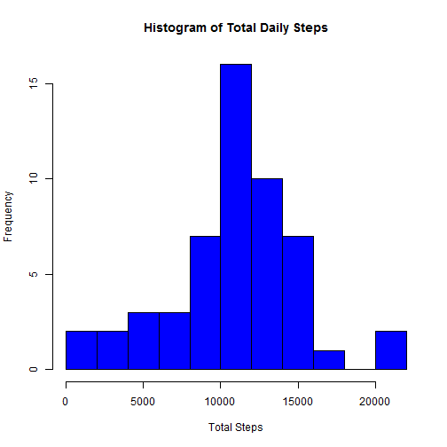
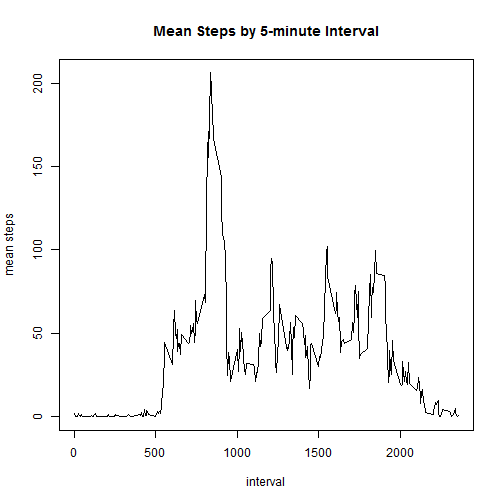
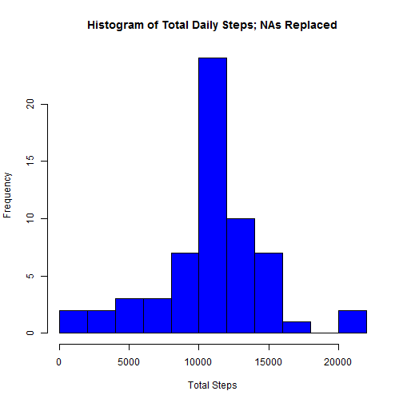
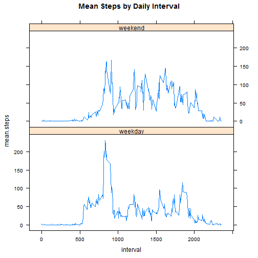

# Reproducible Research: Peer Assessment 1

Data retrieved from (https://d396qusza40orc.cloudfront.net/repdata%2Fdata%2Factivity.zip)  
August, 2014

## Loading and preprocessing the data
Unzip the file if not already unzipped

```r
if(!file.exists("activity.csv")){
  unzip("activity.zip")}
```
Read the file into a new data frame and change the data field from factor to 
date format

```r
activity<-read.csv("activity.csv")
activity$date<-as.Date(activity$date)
```

## What is mean total number of steps taken per day?  
NA values are to be omitted from this analysis

```r
noNA<-na.omit(activity)
```
Then we can total the number of steps by each day using the ddply() function

```r
library(plyr)
dailysteps1<-ddply(noNA,.(date), summarize, sum=sum(steps))
```
**Make a histogram of the total number of steps taken each day.**  
Use the recently created table of total steps per day to create a histogram

```r
hist(dailysteps1$sum, col="blue", breaks=15, main="Histogram of Total Daily Steps", 
     xlab="Total Steps")
```

 
  
**Calculate and report the mean and median total number of steps taken per day**  
Use the table of total steps per day: the summary() function will provide the
mean and median

```r
summary(dailysteps1)
```

```
##       date                 sum       
##  Min.   :2012-10-02   Min.   :   41  
##  1st Qu.:2012-10-16   1st Qu.: 8841  
##  Median :2012-10-29   Median :10765  
##  Mean   :2012-10-30   Mean   :10766  
##  3rd Qu.:2012-11-16   3rd Qu.:13294  
##  Max.   :2012-11-29   Max.   :21194
```
  
The mean is 10,766 steps per day and the median is 10,765 steps per day  
## What is the average daily activity pattern?  
**Make a time series plot of the 5-minute intervals and the average number of steps
take across all days**  
Use ddply again to average the steps by interval

```r
intmean1<-ddply(noNA,.(interval), summarize, mean=mean(steps))
```
Use this data to create a plot

```r
with(intmean1, plot(interval, mean, main="Mean Steps by 5-minute Interval", 
      ylab="mean steps", type="l"))
```

 
  
**Which 5 minute interval, on average across all days, contains the maximum number of steps?**  
Use the same interval means data set to return the correct interval

```r
intmean1[intmean1$mean==max(intmean1$mean),1]
```

```
## [1] 835
```
  
The interval with the maximum average steps per day is 835, or approximately 8:35 am  
## Imputing missing values  
**Calculate the total number of missing values in the dataset**  
Use the is.na() function to find the NAs

```r
sum(is.na(activity$steps))
```

```
## [1] 2304
```
  
There are 2,304 missing values in the dataset  
  
**Devise a strategy for filling in the missing values**  
Since there is wide variation in the steps by interval, the interval averages will be
used to replace the missing values.  
  
**Create a new dataset that is equal to the original set but with the missing values
filled in**  
Add the interval averages to the data set, replace the NAs with the interval averages,
then remove the averages to produce an identical data set. (Warning can be ignored)


```r
NAreplace<-data.frame(steps=activity$steps, date=activity$date, 
          interval=activity$interval, intmean=rep(intmean1$mean,61))
NAreplace$steps[is.na(NAreplace$steps)]<-NAreplace$intmean
```

```
## Warning: number of items to replace is not a multiple of replacement
## length
```

```r
NAreplace<-NAreplace[,1:3]
```
  
**Make a histogram of the total steps per day and calculate the mean and median**
Use ddply() again on the new data to sum steps by day

```r
dailysteps2<-ddply(NAreplace,.(date), summarize, sum=sum(steps))
```
Create a histogram with the new data (otherwise identical to the histogram produced with the original data set)

```r
hist(dailysteps2$sum, col="blue", breaks=15, main="Histogram of Total Daily Steps; NAs Replaced", 
     xlab="Total Steps")
```

 
  
Use the summary() function to determine the mean and median

```r
summary(dailysteps2)
```

```
##       date                 sum       
##  Min.   :2012-10-01   Min.   :   41  
##  1st Qu.:2012-10-16   1st Qu.: 9819  
##  Median :2012-10-31   Median :10766  
##  Mean   :2012-10-31   Mean   :10766  
##  3rd Qu.:2012-11-15   3rd Qu.:12811  
##  Max.   :2012-11-30   Max.   :21194
```
The mean is 10,766 and the median is 10,766 steps per day 
## Are there differences in activity patterns between weekdays and weekends?
**Create a new variable in the dataset to indicate 'weekday' and 'weekend'.**  
Create a table indicating which days are to be coded as weekdays and weekends (i.e. 
Monday=Weekday etc.)

```r
days<-c("Monday","Tuesday","Wednesday","Thursday","Friday","Saturday","Sunday")
code<-c(rep("weekday",5),rep("weekend",2))
codetable<-data.frame(weekdays=days, code=code)
```
Use the weekdays() function to add a column with the day

```r
wkcodes<-data.frame(steps=NAreplace$steps, date=NAreplace$date, interval=NAreplace$interval,
          weekdays=weekdays(NAreplace$date))
```
Join the new table to the code table with the weekend/weekday designation

```r
wkcodes<-join(wkcodes, codetable, by="weekdays")
head(wkcodes)
```

```
##     steps       date interval weekdays    code
## 1 1.71698 2012-10-01        0   Monday weekday
## 2 0.33962 2012-10-01        5   Monday weekday
## 3 0.13208 2012-10-01       10   Monday weekday
## 4 0.15094 2012-10-01       15   Monday weekday
## 5 0.07547 2012-10-01       20   Monday weekday
## 6 2.09434 2012-10-01       25   Monday weekday
```
  
**Make a panel plot of the 5-minute intervals and the average steps taken across all weekends or weekdays**  
First we need to subset the data by weekend and weekdays so we we can average the intervals accordingly

```r
wkday<-wkcodes[wkcodes$code=="weekday",]
  wkday<-ddply(wkday,.(interval), summarize, mean=mean(steps))
  wkday<-data.frame(interval=wkday$interval, mean.steps=wkday$mean, code=rep("weekday",288))

wkend<-wkcodes[wkcodes$code=="weekend",]
  wkend<-ddply(wkend,.(interval), summarize, mean=mean(steps))
  wkend<-data.frame(interval=wkend$interval, mean.steps=wkend$mean, code=rep("weekend",288))
```
Then we can join the two idividual tables of weekend and weekday averages back to one table

```r
intmean2<-rbind(wkday, wkend)
```
Using a lattice plot, we can generate the plot required

```r
library(lattice)
xyplot(mean.steps~interval|code, data=intmean2, layout=c(1,2), type="l", 
         main="Mean Steps by Daily Interval")
```

 
  
From the plot, we can see that:  
1. weekday activity begins and ends earlier than weekend activity  
2. weekend activity is more evenly dispersed throughout daylight hours  
3. weekday activity is greatest in the morning before 10 am  
